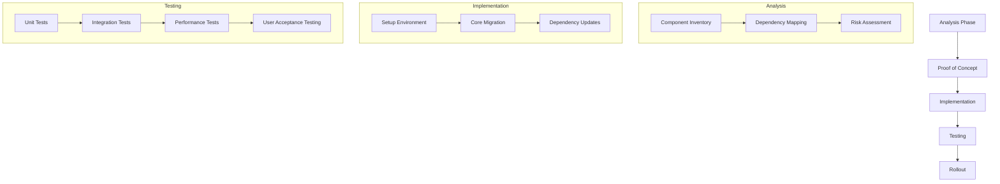
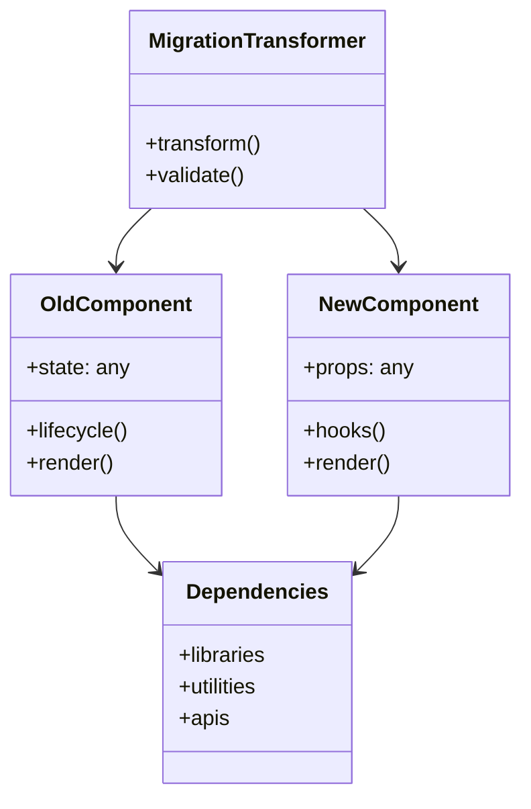
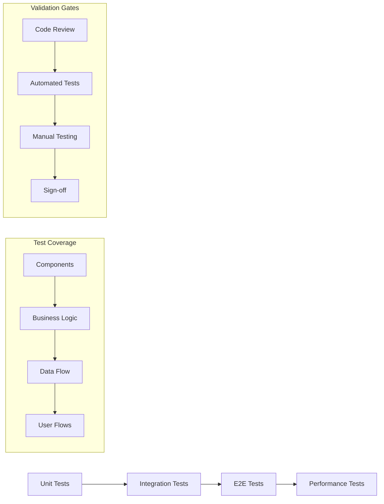

# {title}

# Migration Project Documentation

## Overview
**Project Name:** [Project Name]
**Migration Type:** [Framework/Platform/Language]
**Start Date:** [Date]
**Target Completion:** [Date]

## Executive Summary
Brief overview of the migration goals, scope, and expected outcomes.

## Migration Process


## Migration Scope
### In Scope
- Component A
- Feature B
- Subsystem C

### Out of Scope
- Legacy System D
- External Integration E

## Technical Assessment
### Source System
- Framework/Platform: [Name & Version]
- Key Dependencies
- Architecture Pattern

### Target System
- Framework/Platform: [Name & Version]
- Key Dependencies
- Architecture Pattern

## Component Architecture


## Migration Strategy
### Phase 1: Analysis & Planning
- [ ] Component inventory
- [ ] Dependency mapping
- [ ] Risk assessment
- [ ] Resource allocation

### Phase 2: Proof of Concept
- [ ] Select representative components
- [ ] Develop migration patterns
- [ ] Validate approach
- [ ] Document learnings

### Phase 3: Implementation
- [ ] Set up new environment
- [ ] Migrate core components
- [ ] Update dependencies
- [ ] Refactor as needed

## Testing Strategy


### Technical Patterns
```javascript
// Before
class OldComponent {
  // Old implementation
}

// After
const NewComponent = () => {
  // New implementation
}
```

### State Management
- Previous approach
- New approach
- Migration path